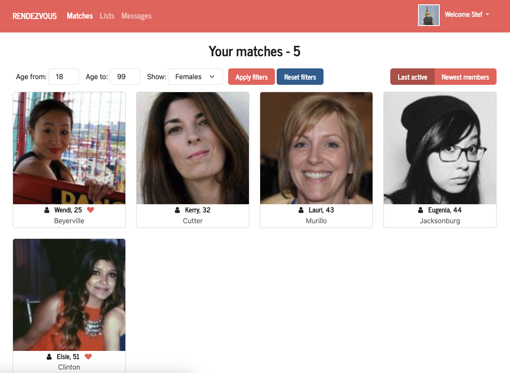

# Rendezvous

Rendezvous is dating application which can help members find matches, communicate and build connections.

## Functionalities

Application provides functionalities based on roles.

### Members

- **Profile and Photos** - Members can manage their profile, and upload photos which are reviewed by admins or moderators.
- **Matches** - Members can browse and view other members' profiles.
- **Likes** - Members can like other members' profiles and see who likes them.
- **Messaging** - Members can send and receive messages to/from other members.

### Moderators

- **Photo Management** - Moderators can approve or reject member photos.

### Admins

- **User Management** - Admins can modify member roles.
- **Photo Management** - Admins can approve or reject member photos.
